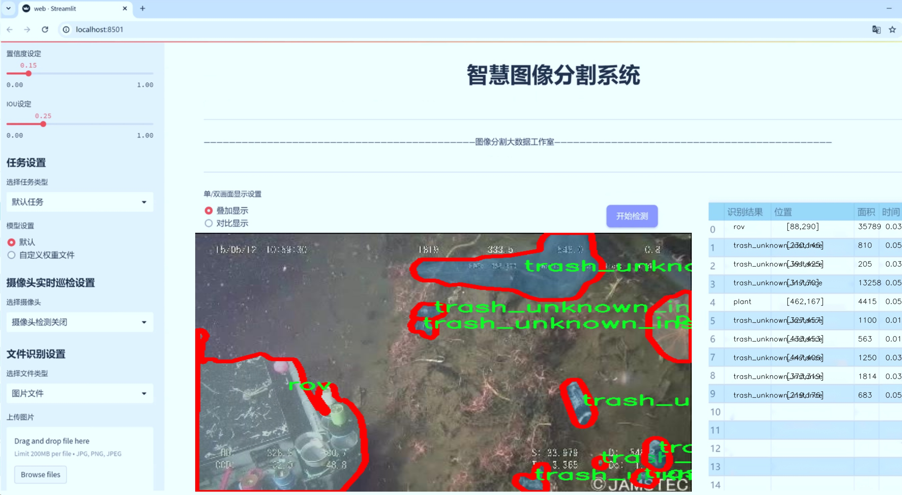
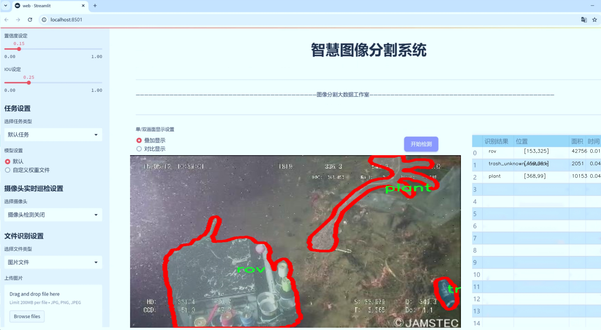
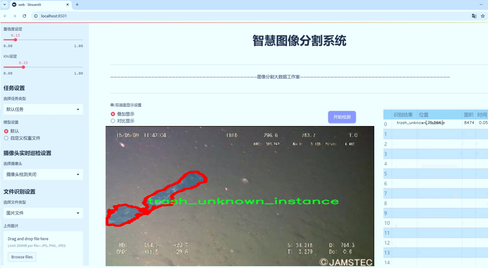
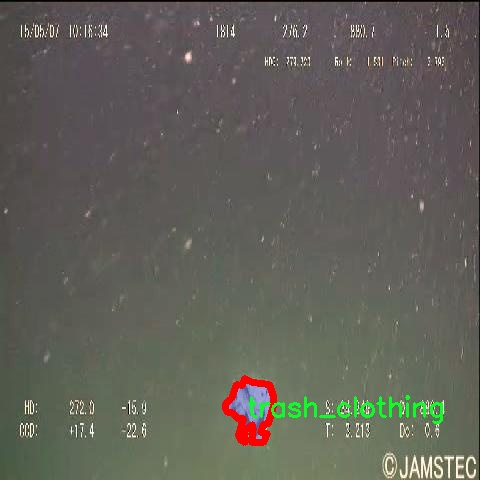
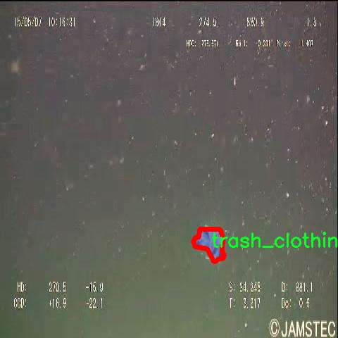
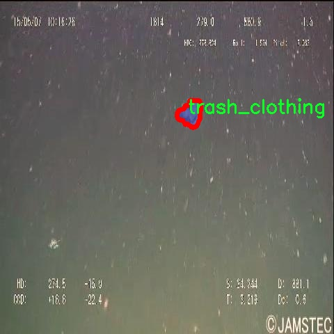
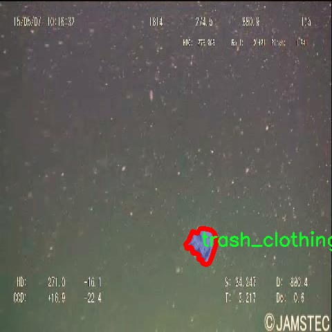

# 海洋垃圾与生物分割系统源码＆数据集分享
 [yolov8-seg-LAWDS＆yolov8-seg-AFPN-P345等50+全套改进创新点发刊_一键训练教程_Web前端展示]

### 1.研究背景与意义

项目参考[ILSVRC ImageNet Large Scale Visual Recognition Challenge](https://gitee.com/YOLOv8_YOLOv11_Segmentation_Studio/projects)

项目来源[AAAI Global Al lnnovation Contest](https://kdocs.cn/l/cszuIiCKVNis)

研究背景与意义

随着全球经济的快速发展和人口的持续增长，海洋环境面临着前所未有的压力。海洋垃圾问题已成为全球性挑战，严重影响了海洋生态系统的健康和生物多样性。根据联合国环境规划署的报告，全球每年有超过800万吨的塑料垃圾进入海洋，这不仅对海洋生物造成了直接威胁，还通过食物链影响到人类的健康。因此，开发有效的海洋垃圾监测与处理系统，成为了当今科学研究的重要课题之一。

在此背景下，计算机视觉技术的迅猛发展为海洋垃圾的检测与分割提供了新的解决方案。尤其是基于深度学习的目标检测和实例分割技术，已经在多个领域取得了显著的成果。YOLO（You Only Look Once）系列模型因其高效的实时检测能力，逐渐成为目标检测领域的主流选择。YOLOv8作为该系列的最新版本，具备了更强的特征提取能力和更高的检测精度，为海洋垃圾与生物的分割提供了有力的技术支持。

本研究旨在基于改进的YOLOv8模型，构建一个高效的海洋垃圾与生物分割系统。我们将利用包含7300张图像的“debris_UCM”数据集，该数据集涵盖了22个类别，包括多种海洋生物（如螃蟹、鳗鱼、鱼类、海星等）和多种类型的海洋垃圾（如塑料袋、瓶子、衣物、容器等）。通过对这些数据的深入分析与处理，我们希望能够实现对海洋垃圾与生物的高精度分割，从而为海洋生态保护提供科学依据。

研究的意义不仅在于技术层面的创新，更在于其对海洋环境保护的深远影响。通过准确识别和分割海洋垃圾与生物，我们可以更好地评估海洋生态系统的健康状况，制定相应的保护措施。此外，该系统还可以为海洋垃圾的清理工作提供实时数据支持，帮助相关部门高效地开展清理行动，减少海洋垃圾对生态的负面影响。

同时，本研究还将推动计算机视觉技术在环境保护领域的应用，探索深度学习模型在复杂自然场景中的表现。通过改进YOLOv8模型，我们将探讨如何提高模型在海洋环境中对多样化目标的检测能力，进而为未来的研究提供新的思路和方法。

综上所述，基于改进YOLOv8的海洋垃圾与生物分割系统的研究，不仅具有重要的学术价值，也为实际的海洋环境保护工作提供了切实可行的技术支持。通过这一研究，我们期望能够为全球海洋生态保护贡献一份力量，推动可持续发展的实现。

### 2.图片演示







##### 注意：由于此博客编辑较早，上面“2.图片演示”和“3.视频演示”展示的系统图片或者视频可能为老版本，新版本在老版本的基础上升级如下：（实际效果以升级的新版本为准）

  （1）适配了YOLOV8的“目标检测”模型和“实例分割”模型，通过加载相应的权重（.pt）文件即可自适应加载模型。

  （2）支持“图片识别”、“视频识别”、“摄像头实时识别”三种识别模式。

  （3）支持“图片识别”、“视频识别”、“摄像头实时识别”三种识别结果保存导出，解决手动导出（容易卡顿出现爆内存）存在的问题，识别完自动保存结果并导出到tempDir中。

  （4）支持Web前端系统中的标题、背景图等自定义修改，后面提供修改教程。

  另外本项目提供训练的数据集和训练教程,暂不提供权重文件（best.pt）,需要您按照教程进行训练后实现图片演示和Web前端界面演示的效果。

### 3.视频演示

[3.1 视频演示](https://www.bilibili.com/video/BV1CoydY7EoC/)

### 4.数据集信息展示

##### 4.1 本项目数据集详细数据（类别数＆类别名）

nc: 22
names: ['animal_crab', 'animal_eel', 'animal_etc', 'animal_fish', 'animal_shells', 'animal_starfish', 'plant', 'rov', 'trash_bag', 'trash_bottle', 'trash_branch', 'trash_can', 'trash_clothing', 'trash_container', 'trash_cup', 'trash_net', 'trash_pipe', 'trash_rope', 'trash_snack_wrapper', 'trash_tarp', 'trash_unknown_instance', 'trash_wreckage']


##### 4.2 本项目数据集信息介绍

数据集信息展示

在本研究中，我们采用了名为“debris_UCM”的数据集，以训练和改进YOLOv8-seg模型，旨在实现海洋垃圾与生物的高效分割。该数据集包含22个类别，涵盖了丰富的海洋生物和各种类型的海洋垃圾，为模型的训练提供了多样化的样本。这些类别不仅包括常见的海洋生物，如螃蟹、鳗鱼、鱼类、贝壳和海星等，还涵盖了多种海洋垃圾，如塑料袋、瓶子、树枝、垃圾桶、衣物、容器、杯子、渔网、管道、绳索、零食包装、帆布、未知垃圾实例以及残骸等。

数据集中的生物类别如“animal_crab”、“animal_eel”、“animal_fish”等，展示了海洋生态系统的多样性。这些生物在海洋环境中扮演着重要的角色，理解它们的分布和行为对于生态保护和资源管理至关重要。与此同时，数据集中包含的垃圾类别则反映了当前海洋污染的严峻现实。塑料袋、瓶子和其他日常生活垃圾的存在，不仅对海洋生物构成威胁，也对整个生态系统的健康造成了影响。

通过对“debris_UCM”数据集的分析，我们可以发现其在类别设计上的合理性和全面性。每个类别都经过精心挑选，以确保能够有效地训练出一个既能识别海洋生物，又能检测海洋垃圾的分割模型。这种双重识别能力对于实现海洋环境的保护和清理具有重要意义。在实际应用中，改进后的YOLOv8-seg模型将能够实时监测海洋中的生物和垃圾，为海洋保护工作提供数据支持。

此外，数据集的构建也考虑到了不同类型垃圾的特征。例如，垃圾袋和垃圾瓶的形状、颜色和材质各异，而海洋生物的外观则更加多样化。这种多样性使得模型在训练过程中能够学习到更为复杂的特征，从而提高其在实际应用中的鲁棒性和准确性。通过对这些类别的深入学习，模型将能够在复杂的海洋环境中有效地区分生物与垃圾，进而为海洋清理和保护提供技术支持。

在未来的研究中，我们将进一步探索如何利用“debris_UCM”数据集中的信息，优化YOLOv8-seg模型的参数设置和训练策略，以提高其在海洋垃圾与生物分割任务中的表现。通过不断迭代和改进，我们期望能够为海洋环境的可持续发展贡献一份力量，推动海洋保护技术的进步和应用。总之，“debris_UCM”数据集不仅为本研究提供了宝贵的资源，也为未来的海洋生态研究和垃圾清理工作奠定了基础。










### 5.全套项目环境部署视频教程（零基础手把手教学）

[5.1 环境部署教程链接（零基础手把手教学）](https://www.bilibili.com/video/BV1jG4Ve4E9t/?vd_source=bc9aec86d164b67a7004b996143742dc)


[5.2 安装Python虚拟环境创建和依赖库安装视频教程链接（零基础手把手教学）](https://www.bilibili.com/video/BV1nA4VeYEze/?vd_source=bc9aec86d164b67a7004b996143742dc)

### 6.手把手YOLOV8-seg训练视频教程（零基础小白有手就能学会）

[6.1 手把手YOLOV8-seg训练视频教程（零基础小白有手就能学会）](https://www.bilibili.com/video/BV1cA4VeYETe/?vd_source=bc9aec86d164b67a7004b996143742dc)


按照上面的训练视频教程链接加载项目提供的数据集，运行train.py即可开始训练



     Epoch   gpu_mem       box       obj       cls    labels  img_size
     1/200     0G   0.01576   0.01955  0.007536        22      1280: 100%|██████████| 849/849 [14:42<00:00,  1.04s/it]
               Class     Images     Labels          P          R     mAP@.5 mAP@.5:.95: 100%|██████████| 213/213 [01:14<00:00,  2.87it/s]
                 all       3395      17314      0.994      0.957      0.0957      0.0843

     Epoch   gpu_mem       box       obj       cls    labels  img_size
     2/200     0G   0.01578   0.01923  0.007006        22      1280: 100%|██████████| 849/849 [14:44<00:00,  1.04s/it]
               Class     Images     Labels          P          R     mAP@.5 mAP@.5:.95: 100%|██████████| 213/213 [01:12<00:00,  2.95it/s]
                 all       3395      17314      0.996      0.956      0.0957      0.0845

     Epoch   gpu_mem       box       obj       cls    labels  img_size
     3/200     0G   0.01561    0.0191  0.006895        27      1280: 100%|██████████| 849/849 [10:56<00:00,  1.29it/s]
               Class     Images     Labels          P          R     mAP@.5 mAP@.5:.95: 100%|███████   | 187/213 [00:52<00:00,  4.04it/s]
                 all       3395      17314      0.996      0.957      0.0957      0.0845


### 7.50+种全套YOLOV8-seg创新点代码加载调参视频教程（一键加载写好的改进模型的配置文件）

[7.1 50+种全套YOLOV8-seg创新点代码加载调参视频教程（一键加载写好的改进模型的配置文件）](https://www.bilibili.com/video/BV1Hw4VePEXv/?vd_source=bc9aec86d164b67a7004b996143742dc)

### 8.YOLOV8-seg图像分割算法原理

原始YOLOv8-seg算法原理

YOLOv8-seg算法是目标检测和图像分割领域的一项重要进展，继承了YOLO系列算法的优良传统，同时在多个方面进行了创新和优化。该算法由Glenn Jocher提出，作为YOLOv3和YOLOv5的延续，YOLOv8-seg在结构设计、数据处理和损失函数等方面都做出了显著改进，使其在处理复杂的视觉任务时表现得更加高效和准确。

首先，YOLOv8-seg在数据预处理方面延续了YOLOv5的策略，采用了多种增强手段以提高模型的鲁棒性和泛化能力。这些增强手段包括马赛克增强、混合增强、空间扰动和颜色扰动等。其中，马赛克增强通过将四张不同的图像随机缩放并拼接成一张新图像，迫使模型学习到更多样化的特征，从而提高其对不同场景的适应能力。混合增强则通过将两张图像进行混合，进一步丰富了训练样本的多样性。空间扰动和颜色扰动则通过对图像进行随机变换，增强了模型对不同光照和视角变化的适应性。这些预处理技术的引入，使得YOLOv8-seg在面对复杂背景和多样化目标时，能够保持较高的检测精度。

在网络结构方面，YOLOv8-seg对骨干网络进行了重要的改进。原有的C3模块被新的C2f模块所替代，C2f模块通过引入更多的分支来丰富梯度回传时的支流，进而增强了特征提取的能力。C2f模块的设计灵感来源于YOLOv7中的ELAN模块，旨在提高特征提取的效率和精度。该模块不仅保持了轻量化的特性，还通过并行的梯度流分支，确保了网络在处理高维特征时的灵活性和准确性。

YOLOv8-seg还采用了FPN（特征金字塔网络）和PAN（路径聚合网络）结构，以实现多尺度特征的有效融合。这种结构能够充分利用不同层次的特征信息，使得模型在处理不同大小的目标时，能够更好地捕捉到关键信息。通过将C3模块替换为C2f模块，YOLOv8-seg在特征融合层的表现得到了进一步提升，确保了在多尺度检测任务中的高效性。

在检测头的设计上，YOLOv8-seg引入了解耦头（Decoupled Head）结构。这一结构将分类和定位任务分开处理，分别使用不同的卷积层进行特征提取，从而提高了模型的检测精度。与以往的耦合头结构相比，解耦头的设计使得模型在处理复杂场景时，能够更好地平衡分类和定位的任务，减少了任务间的干扰。此外，YOLOv8-seg还采用了无锚框（Anchor-Free）的方法，摒弃了传统的基于锚框的检测策略。通过将目标检测转化为关键点检测，YOLOv8-seg能够更灵活地适应不同类型的目标，简化了模型的结构，提高了计算效率。

在标签分配策略方面，YOLOv8-seg采用了TOOD（Target-Oriented Object Detection）策略，这是一种动态标签分配的方法。与YOLOX的SimOTA策略不同，TOOD策略能够根据目标的特征动态调整标签的分配，确保正负样本的匹配更加合理。YOLOv8-seg的损失函数设计也得到了优化，分类损失采用了变焦损失（Varifocal Loss），而回归损失则结合了CIoU损失和DFL损失。这种损失函数的设计使得模型在训练过程中能够更有效地聚焦于高质量的样本，提高了检测的准确性。

最后，YOLOv8-seg在模型的轻量化方面也做出了努力。通过优化网络结构，减少冗余的计算，YOLOv8-seg在保持高性能的同时，显著降低了模型的复杂度。这使得YOLOv8-seg不仅适用于高性能的计算环境，也能够在资源受限的设备上进行实时检测和分割任务。

综上所述，YOLOv8-seg算法通过在数据预处理、网络结构、检测头设计、标签分配策略和损失函数等多个方面的创新，极大地提升了目标检测和图像分割的性能。其高效的特征提取能力、灵活的标签分配机制以及优化的损失函数设计，使得YOLOv8-seg在实际应用中展现出了优越的性能，成为当前视觉任务中一个重要的工具。随着YOLOv8-seg的不断发展和完善，未来在更多复杂场景下的应用将会更加广泛，推动计算机视觉领域的进一步进步。


### 9.系统功能展示（检测对象为举例，实际内容以本项目数据集为准）

图9.1.系统支持检测结果表格显示

  图9.2.系统支持置信度和IOU阈值手动调节

  图9.3.系统支持自定义加载权重文件best.pt(需要你通过步骤5中训练获得)

  图9.4.系统支持摄像头实时识别

  图9.5.系统支持图片识别

  图9.6.系统支持视频识别

  图9.7.系统支持识别结果文件自动保存

  图9.8.系统支持Excel导出检测结果数据


### 10.50+种全套YOLOV8-seg创新点原理讲解（非科班也可以轻松写刊发刊，V11版本正在科研待更新）

#### 10.1 由于篇幅限制，每个创新点的具体原理讲解就不一一展开，具体见下列网址中的创新点对应子项目的技术原理博客网址【Blog】：


[10.1 50+种全套YOLOV8-seg创新点原理讲解链接](https://gitee.com/qunmasj/good)

#### 10.2 部分改进模块原理讲解(完整的改进原理见上图和技术博客链接)【如果此小节的图加载失败可以通过CSDN或者Github搜索该博客的标题访问原始博客，原始博客图片显示正常】
### YOLOv8简介
在各种目标检测算法中，YOLO系列因其速度和准确度间的优异平衡脱颖而出，能够准确、快速的识别目标，便于部署到各种移动设备中，已经广泛应用于各种领域的目标检测、跟踪和分割。目前最新版本 YOLOv8由原v5的开发团队Ultralytics于2023年1月提出，按规格大小可划分为n、s、m、1和x5个版本，是目前最先进的目标检测算法，有着优异的性能，很适合用于无人机航拍图像目标检测。其网络结构如图所示。

YOLOv8模型包括Input、Backbone、Neck 和Head4部分。其中 Input选用了Mosaic数据增强方法，并且对于不同大小的模型，有部分超参数会进行修改，典型的如大模型会开启 MixUp 和CopyPaste数据增强，能够丰富数据集，提升模型的泛化能力和鲁棒性。Backbone主要用于提取图片中的信息，提供给Neck和Head使用，由多个Conv、C2f模块和尾部的SPPF组成。Conv模块由单个Conv2d、
BatchNorm2d和激活函数构成,用丁是双行在万E5特征图;YOLOv8参考了C3模块的残左绒以心YOLOv7[16l的ELAN思想，设计出了C2f 结构，可以在保证轻量化的同时获得更加丰富的梯度流信息，并根据模型尺度来调整通道数，大幅提升了模型性能;SPPF是空间金字塔池化，能够融合不同尺度的特征。Neck部分主要起特征融合的作用，充分利用了骨干网络提取的特征，采用FPN[17]+PAN[18〕结构，
能够增强多个尺度上的语义表达和定位能力。Head输出端根据前两部分处理得到的特征来获取检测目标的类别和位置信息，做出识别,换以小旦公来和定解耦头结构,将分类和检测头分:9w‘无锅框的位关注侧重点不同的问题，同时也采用了无锚框的目标检测（Anchor-Free)，能够提升检测速度。Loss计算方面采用了正负样本动态分配策略，使用 VFLLoss 作为分类损失，使用DFLLoss+CIOU Loss作为回归损失。

### AutoFocus: Efficient Multi-Scale Conv简介

参考该博客提出了AutoFocus，一种高效的多尺度目标检测算法。相较于以前对整个图像金字塔进行处理，该方法以一种由表及里的姿态，仅处理哪些整体上看来很有可能存在小物体的区域。这个可以通过预测一张类别未知的分割图FocusPixels来得到。为了高效利用FocusPixels，另外一个算法用于产生包含FocusPixels的FocusChips，这样可以减少计算量并处理更更精细的尺度。在不同尺度上FocusChips所得到的检测结果综合时，会出现问题，我们也提供了解决问题的方案。AutoFocus在COCO上的结果有49.7%mAP（50%重叠下68.3%），与多尺度baseline相仿但是快了2.5倍。金字塔中处理的像素数量减少了5倍mAP只下降1%，在与RetinaNet采用相同的ResNet-101结构且速度相同时，高了10%mAP。

人类寻找物体是一个动态的过程，且寻找时间与场景的复杂度是直接相关的。当我们的眼神在不同的点之间漂移时，其他的区域会被我们有意忽视。然而，现在的检测算法是一种静态的推理过程且图像金字塔中的每个像素都受到了一样的对待，这使得过程变得没有效率。现在许多的应用都不强调实时性，而计算上的节省其实可以产生很大收益。

在COCO数据集中，虽然40%的物体都是小物体，但是它们一共只占了全图的0.3%。如果金字塔是3倍关系，则在高分辨率层要进行9倍的运算。XXX 。那么有没有办法在低分辨率下找出可能含有这些物体的区域呢？

以人眼方案类比，我们可以从低分辨率图像开始，找出有可能存在物体的区域再“聚集”到高分辨率。我们的AutoFocus会在一层中计算小物体的分割图FocusPixels，而在每一个FocusPixels上会用一个算法产生下一层所需要关注的chips。在COCO的最大分辨率层上我们可以只处理**20%的像素而性能不下降，如果只处理5%**也只下降1%而已。


图像金字塔与卷积神经网络对CV十分重要。然而卷积神经网络无法做到对尺度不敏感，所以为了不同大小的物体需要依赖图像金字塔。虽然训练已经有了高效的方法，但是其推断时间依然远离实际使用标准。

目标检测加速有很长历史了。常用的有特征近似以减少尺度、级联、特征金字塔，且最后一个最近很多人研究。

AutoFocus为速度与精度之间提供了一个平滑的折衷，指出可以在低分辨率下看出小物体的所在，从而节约计算。FocusPixels的计算较为容易。

先简单介绍一下SNIP，是一种多尺度的训练、推断算法。主要思想是训练针对某个特定scale的检测器而不是scale-invariant检测器。这样训练样本就局限于在某个尺度范围内，以适于这个检测器处理。比如在高分辨率仅处理小物体而高分辨率仅处理大物体，其优势在于训练时不用考虑尺度的变化。

由于训练时物体大小是已知的，我们在图像金字塔中可以忽略大量区域而只处理物体周围的区域。SNIPER说明这样低分辨率的训练与全图训练相比并不会降低性能。同样，在推断过程中如果可以在大分辨率图像上预测可能出现小物体的chip，我们也就不用处理整张高分辨率图片。在训练时，许多物体会被裁剪、扭曲，这可以当作是一种数据扩增，然而当这个情况在推断时出现，则会产生错误，所以我们还需要一个算法来整合不同尺度上的检测结果。

#### AutoFocus框架
如SIFT、SURF等传统分类特征包含两个组件，一个detector和一个descriptor。detector只包含轻量级的操作如DoG、LoG，用于在整张图片上找到感兴趣的区域；descriptor，一般来说计算量比较大，则只需要关注那些咸兴趣的区域。这个级联结构保障了图片处理的效率。

同样，AutoFocus框架也是用于预测感兴趣的区域，并丢弃在下一尺度不可能存在物体的区域，并将裁剪和缩放后的区域传递给下一尺度。AutoFocus由三个部分组成：FocusPixels，FocusChips和focus stacking。

#### FocusPixels
FocusPixels定义在卷积网络特征图的粒度之上（如conv5），如果特征图上某个像素与小物体有重叠则标注为一个FocusPixel。（小物体：面积处于一个网络的输入范围之内）。训练过程中，FocusPixels标注为正，某些与不在面积范围内的物体有重叠的像素标注为无效，其他像素标注为负。AutoFocus的训练目标是使在FocusPixels区域产生较大的激活值。

如果同时多个物体与同一像素重叠，优先给正标注。我们的网络输入是512x512，然后a,b,c取值分别是5,64,90。对于太大或太小的物体，我们认为当前尺度上没有足够人信息进行判断，所以会标定为无效。整个网络结构如下图。训练时加两层带ReLU的卷积(3x3和1x1)以及一个二分类softmax来预测FocusPixels。


#### FocusChip生成
推断过程中，我们标注输出概率大于阈值t的像素（这个参数可以控制加速比），得到一些连通域。对于每一个域，我们做一次膨胀使其包含一些有助于识别的周围信息，膨胀后相连的部分要合并。然后，我们生成一些包含连通域的chips（不同chips可能重叠，如有重叠则合并）。有些chip可能太小缺少必要信息，并使chip的大小变化很大，为了效率我们要求保证一个最小的chip size。算法流程如下：


#### 级联推断过程
我们的过程类似于图片金字塔的推断过程但是在过程中一步步去除不关注的图片区域。我们在最低分辨率上进行检测并生成chips，然后在这些chips再进行检测和生成chips。

#### Focus Stacking
这种级联分类器的一个问题是在chip边缘本来的大物体可能生成一些被剪裁的检测目标。在下一个尺度上，由于剪裁过了，所以会检测到小的、错误的正例False Positive。之前算法中的第二步膨胀其实就是为了保证没有物体会出现在chip的边缘。这样，当我们在局部图片chip的边缘检测到物体时，就可以把这个检测结果丢弃，即使其在SNIP的范围内。

也有一些物体在图片边缘的特殊情况。如果chip和图片共享一条边的话，我们会检查检测结果的其他边是否完全在里面，如果在，则保留它，否则丢弃。

在每一尺度得到有效检测结果后，我们可以将不同尺度上的结果进行整合，将这些结果映射到原图坐标系上。最后，非极大值抑制NMS用于聚集。网络结构如之前的图片所示。


### 11.项目核心源码讲解（再也不用担心看不懂代码逻辑）

#### 11.1 ui.py

以下是代码的核心部分，并附上详细的中文注释：

```python
import sys
import subprocess

def run_script(script_path):
    """
    使用当前 Python 环境运行指定的脚本。

    Args:
        script_path (str): 要运行的脚本路径

    Returns:
        None
    """
    # 获取当前 Python 解释器的路径
    python_path = sys.executable

    # 构建运行命令，使用 streamlit 运行指定的脚本
    command = f'"{python_path}" -m streamlit run "{script_path}"'

    # 执行命令
    result = subprocess.run(command, shell=True)
    # 检查命令执行的返回码，如果不为0则表示出错
    if result.returncode != 0:
        print("脚本运行出错。")

# 主程序入口
if __name__ == "__main__":
    # 指定要运行的脚本路径
    script_path = "web.py"  # 这里可以直接指定脚本名称

    # 调用函数运行脚本
    run_script(script_path)
```

### 代码说明：
1. **导入模块**：
   - `sys`：用于访问与 Python 解释器紧密相关的变量和函数。
   - `subprocess`：用于创建新进程、连接到它们的输入/输出/错误管道，并获得返回码。

2. **`run_script` 函数**：
   - 该函数接收一个脚本路径作为参数，并使用当前 Python 环境运行该脚本。
   - `sys.executable` 获取当前 Python 解释器的路径，以确保使用正确的 Python 版本。
   - 使用 `subprocess.run` 执行构建的命令，并检查返回码以确定脚本是否成功运行。

3. **主程序入口**：
   - 通过 `if __name__ == "__main__":` 确保只有在直接运行该脚本时才会执行以下代码。
   - 指定要运行的脚本路径（在这里是 `web.py`），并调用 `run_script` 函数执行该脚本。

这个程序文件名为 `ui.py`，主要功能是通过当前的 Python 环境来运行一个指定的脚本。代码中首先导入了必要的模块，包括 `sys`、`os` 和 `subprocess`，以及一个自定义的模块 `QtFusion.path` 中的 `abs_path` 函数。

在文件中定义了一个名为 `run_script` 的函数，该函数接受一个参数 `script_path`，表示要运行的脚本的路径。函数内部首先获取当前 Python 解释器的路径，使用 `sys.executable` 获取到 Python 的可执行文件路径。接着，构建一个命令字符串，命令的格式是使用 Python 解释器运行 `streamlit` 模块，并指定要运行的脚本。

使用 `subprocess.run` 方法来执行构建好的命令。这个方法会在子进程中运行命令，并等待其完成。执行后，程序会检查返回的状态码，如果状态码不为 0，表示脚本运行出错，则打印出相应的错误信息。

在文件的最后部分，使用 `if __name__ == "__main__":` 语句来确保当该文件作为主程序运行时，才会执行以下代码。这里指定了要运行的脚本路径为 `web.py`，并调用 `run_script` 函数来执行这个脚本。

整体来看，这个程序的主要作用是提供一个简单的接口来运行指定的 Python 脚本，特别是使用 `streamlit` 进行 Web 应用开发时，能够方便地启动相应的应用。

#### 11.2 ultralytics\utils\triton.py

以下是经过简化和注释的核心代码部分：

```python
# 导入必要的库
from typing import List
from urllib.parse import urlsplit
import numpy as np

class TritonRemoteModel:
    """
    与远程Triton推理服务器模型交互的客户端。

    属性:
        endpoint (str): Triton服务器上模型的名称。
        url (str): Triton服务器的URL。
        triton_client: Triton客户端（HTTP或gRPC）。
        InferInput: Triton客户端的输入类。
        InferRequestedOutput: Triton客户端的输出请求类。
        input_formats (List[str]): 模型输入的数据类型。
        np_input_formats (List[type]): 模型输入的numpy数据类型。
        input_names (List[str]): 模型输入的名称。
        output_names (List[str]): 模型输出的名称。
    """

    def __init__(self, url: str, endpoint: str = '', scheme: str = ''):
        """
        初始化TritonRemoteModel。

        参数可以单独提供或从一个集体的'url'参数解析，格式为
            <scheme>://<netloc>/<endpoint>/<task_name>

        参数:
            url (str): Triton服务器的URL。
            endpoint (str): Triton服务器上模型的名称。
            scheme (str): 通信方案（'http'或'gRPC'）。
        """
        # 如果没有提供endpoint和scheme，则从URL中解析
        if not endpoint and not scheme:
            splits = urlsplit(url)
            endpoint = splits.path.strip('/').split('/')[0]  # 获取模型名称
            scheme = splits.scheme  # 获取通信方案
            url = splits.netloc  # 获取服务器地址

        self.endpoint = endpoint  # 设置模型名称
        self.url = url  # 设置服务器URL

        # 根据通信方案选择Triton客户端
        if scheme == 'http':
            import tritonclient.http as client  # 导入HTTP客户端
            self.triton_client = client.InferenceServerClient(url=self.url, verbose=False, ssl=False)
            config = self.triton_client.get_model_config(endpoint)  # 获取模型配置
        else:
            import tritonclient.grpc as client  # 导入gRPC客户端
            self.triton_client = client.InferenceServerClient(url=self.url, verbose=False, ssl=False)
            config = self.triton_client.get_model_config(endpoint, as_json=True)['config']  # 获取模型配置

        # 按字母顺序排序输出名称
        config['output'] = sorted(config['output'], key=lambda x: x.get('name'))

        # 定义模型属性
        type_map = {'TYPE_FP32': np.float32, 'TYPE_FP16': np.float16, 'TYPE_UINT8': np.uint8}
        self.InferRequestedOutput = client.InferRequestedOutput  # 设置输出请求类
        self.InferInput = client.InferInput  # 设置输入类
        self.input_formats = [x['data_type'] for x in config['input']]  # 获取输入数据类型
        self.np_input_formats = [type_map[x] for x in self.input_formats]  # 获取numpy数据类型
        self.input_names = [x['name'] for x in config['input']]  # 获取输入名称
        self.output_names = [x['name'] for x in config['output']]  # 获取输出名称

    def __call__(self, *inputs: np.ndarray) -> List[np.ndarray]:
        """
        使用给定的输入调用模型。

        参数:
            *inputs (List[np.ndarray]): 模型的输入数据。

        返回:
            List[np.ndarray]: 模型输出。
        """
        infer_inputs = []  # 存储输入数据
        input_format = inputs[0].dtype  # 获取输入数据类型
        for i, x in enumerate(inputs):
            # 如果输入数据类型与模型要求不匹配，则转换数据类型
            if x.dtype != self.np_input_formats[i]:
                x = x.astype(self.np_input_formats[i])
            # 创建InferInput对象并设置数据
            infer_input = self.InferInput(self.input_names[i], [*x.shape], self.input_formats[i].replace('TYPE_', ''))
            infer_input.set_data_from_numpy(x)  # 从numpy数组设置数据
            infer_inputs.append(infer_input)  # 添加到输入列表

        # 创建输出请求
        infer_outputs = [self.InferRequestedOutput(output_name) for output_name in self.output_names]
        # 调用Triton客户端进行推理
        outputs = self.triton_client.infer(model_name=self.endpoint, inputs=infer_inputs, outputs=infer_outputs)

        # 返回输出结果
        return [outputs.as_numpy(output_name).astype(input_format) for output_name in self.output_names]
```

### 代码注释说明：
1. **类定义**：`TritonRemoteModel`类用于与Triton推理服务器进行交互，包含模型的基本信息和输入输出处理。
2. **初始化方法**：`__init__`方法用于初始化模型的基本属性，包括解析URL、选择通信方式、获取模型配置等。
3. **调用方法**：`__call__`方法允许用户通过传入numpy数组来调用模型，处理输入数据并返回模型的输出结果。

这个程序文件定义了一个名为 `TritonRemoteModel` 的类，用于与远程的 Triton 推理服务器模型进行交互。该类的主要功能是通过指定的 URL 和模型名称，设置与 Triton 服务器的连接，并能够发送输入数据以获取模型的输出。

在类的初始化方法 `__init__` 中，首先解析输入的 URL，如果没有提供模型的端点和通信协议（HTTP 或 gRPC），则从 URL 中提取这些信息。接着，根据通信协议选择相应的 Triton 客户端库（HTTP 或 gRPC），并创建一个客户端实例。然后，通过客户端获取模型的配置，包括输入和输出的名称及数据类型。

在模型配置中，输出名称会按字母顺序排序，以确保一致性。接下来，程序会根据模型的输入数据类型创建一个类型映射，并将输入和输出的相关信息存储为类的属性。这些属性包括输入的格式、NumPy 数据类型、输入名称和输出名称。

类的 `__call__` 方法允许用户以函数的方式调用模型。它接受一个或多个 NumPy 数组作为输入，并根据输入的格式创建相应的 Triton 输入对象。然后，程序会将这些输入对象发送到 Triton 服务器进行推理，并获取输出结果。最后，输出结果会被转换为 NumPy 数组并返回。

总的来说，这个类封装了与 Triton 推理服务器交互的复杂性，使得用户可以方便地调用远程模型进行推理。

#### 11.3 ultralytics\nn\extra_modules\head.py

以下是经过简化并添加详细中文注释的核心代码部分：

```python
import torch
import torch.nn as nn
from ultralytics.utils.tal import dist2bbox, make_anchors

class Detect_DyHead(nn.Module):
    """YOLOv8 检测头，使用 DyHead 进行目标检测。"""
    
    def __init__(self, nc=80, hidc=256, block_num=2, ch=()):
        """
        初始化检测头参数。
        
        参数:
        nc (int): 类别数量。
        hidc (int): 隐藏层通道数。
        block_num (int): DyHead 中的块数量。
        ch (tuple): 输入通道数。
        """
        super().__init__()
        self.nc = nc  # 类别数量
        self.nl = len(ch)  # 检测层数量
        self.reg_max = 16  # DFL 通道数
        self.no = nc + self.reg_max * 4  # 每个锚点的输出数量
        self.stride = torch.zeros(self.nl)  # 在构建时计算的步幅
        c2, c3 = max((16, ch[0] // 4, self.reg_max * 4)), max(ch[0], self.nc)  # 通道数
        self.conv = nn.ModuleList(nn.Sequential(Conv(x, hidc, 1)) for x in ch)  # 卷积层
        self.dyhead = nn.Sequential(*[DyHeadBlock(hidc) for _ in range(block_num)])  # DyHead 块
        self.cv2 = nn.ModuleList(
            nn.Sequential(Conv(hidc, c2, 3), Conv(c2, c2, 3), nn.Conv2d(c2, 4 * self.reg_max, 1)) for _ in ch)  # 预测框的卷积层
        self.cv3 = nn.ModuleList(nn.Sequential(Conv(hidc, c3, 3), Conv(c3, c3, 3), nn.Conv2d(c3, self.nc, 1)) for _ in ch)  # 类别的卷积层
        self.dfl = DFL(self.reg_max) if self.reg_max > 1 else nn.Identity()  # DFL 层

    def forward(self, x):
        """连接并返回预测的边界框和类别概率。"""
        for i in range(self.nl):
            x[i] = self.conv[i](x[i])  # 对每个输入应用卷积
        x = self.dyhead(x)  # 通过 DyHead 处理
        shape = x[0].shape  # 获取输出形状
        for i in range(self.nl):
            # 将预测框和类别的输出连接在一起
            x[i] = torch.cat((self.cv2[i](x[i]), self.cv3[i](x[i])), 1)
        if self.training:
            return x  # 如果是训练模式，返回所有输出
        else:
            # 动态调整锚点和步幅
            self.anchors, self.strides = (x.transpose(0, 1) for x in make_anchors(x, self.stride, 0.5))
            self.shape = shape

        # 将输出合并为一个张量
        x_cat = torch.cat([xi.view(shape[0], self.no, -1) for xi in x], 2)
        box, cls = x_cat.split((self.reg_max * 4, self.nc), 1)  # 分割边界框和类别
        dbox = dist2bbox(self.dfl(box), self.anchors.unsqueeze(0), xywh=True, dim=1) * self.strides  # 转换为边界框
        y = torch.cat((dbox, cls.sigmoid()), 1)  # 合并边界框和类别概率
        return y  # 返回最终输出

    def bias_init(self):
        """初始化检测头的偏置，警告：需要步幅可用。"""
        for a, b, s in zip(self.cv2, self.cv3, self.stride):  # 遍历卷积层
            a[-1].bias.data[:] = 1.0  # 边界框偏置初始化
            b[-1].bias.data[:self.nc] = math.log(5 / self.nc / (640 / s) ** 2)  # 类别偏置初始化

# 其他类如 Detect_DyHeadWithDCNV3、Detect_AFPN_P345 等可以类似地简化和注释
```

以上代码保留了 YOLOv8 检测头的核心功能，并添加了详细的中文注释，以便于理解每个部分的作用。

这个程序文件 `head.py` 是一个用于 YOLOv8 检测模型的实现，主要包含了不同类型的检测头（Detect Head）类。这些类用于处理图像输入并输出检测结果，包括边界框和类别概率。以下是对代码的详细讲解。

首先，文件导入了一些必要的库，包括数学库、PyTorch 及其神经网络模块，以及一些自定义的模块和函数。这些导入为后续的模型构建和计算提供了基础。

接下来，定义了多个检测头类，主要包括 `Detect_DyHead`、`Detect_AFPN_P345`、`Detect_Efficient` 等。每个类都继承自 `nn.Module`，这是 PyTorch 中所有神经网络模块的基类。

`Detect_DyHead` 类是 YOLOv8 的检测头，使用了动态头（DyHead）来进行目标检测。它的构造函数中初始化了一些参数，包括类别数量、隐藏通道数、块的数量等。它还定义了多个卷积层和动态头块，用于处理输入特征图并生成输出。`forward` 方法实现了前向传播，负责将输入特征图经过各个卷积层和动态头块，最终输出边界框和类别概率。

`Detect_DyHeadWithDCNV3` 类是 `Detect_DyHead` 的一个变体，使用了 DCN（Deformable Convolutional Networks）进行特征提取，增强了模型的表达能力。

`Detect_AFPN_P345` 和 `Detect_AFPN_P2345` 类实现了使用自适应特征金字塔网络（AFPN）的检测头，适用于不同的特征层组合。它们的构造函数中初始化了 AFPN 模块，并定义了卷积层以生成边界框和类别概率。

`Detect_Efficient` 类则是一个高效的检测头实现，设计上更为简洁，适合在资源受限的环境中使用。它通过简单的卷积层组合来生成输出。

`DetectAux` 类是一个辅助检测头，支持多层次的特征融合，并能够输出额外的边界框和类别信息，适用于需要额外输出的场景。

最后，`Segment_Efficient` 类是一个用于分割任务的检测头，继承自 `Detect_Efficient`，并增加了处理分割掩码的功能。它使用原型网络（Proto）来生成分割掩码，并在前向传播中返回分割结果。

每个类中都有 `bias_init` 方法，用于初始化偏置项，以便在训练时更好地收敛。此外，`forward` 方法中包含了对训练和推理模式的处理，确保在不同的模式下模型能够正确地输出结果。

总体来说，这个文件实现了 YOLOv8 模型中不同检测头的结构和功能，支持多种特征提取和输出方式，以适应不同的检测和分割任务。

#### 11.4 ultralytics\nn\extra_modules\ops_dcnv3\test.py

以下是代码中最核心的部分，并附上详细的中文注释：

```python
import torch
from functions.dcnv3_func import DCNv3Function, dcnv3_core_pytorch

# 输入和输出的尺寸
H_in, W_in = 8, 8  # 输入图像的高度和宽度
N, M, D = 2, 4, 16  # N: 批量大小, M: 通道数, D: 特征维度
Kh, Kw = 3, 3  # 卷积核的高度和宽度
remove_center = False  # 是否移除中心点
P = Kh * Kw - remove_center  # 每个卷积核的有效点数
offset_scale = 2.0  # 偏移缩放因子
pad = 1  # 填充大小
dilation = 1  # 膨胀大小
stride = 1  # 步幅
# 计算输出的高度和宽度
H_out = (H_in + 2 * pad - (dilation * (Kh - 1) + 1)) // stride + 1
W_out = (W_in + 2 * pad - (dilation * (Kw - 1) + 1)) // stride + 1

# 设置随机种子
torch.manual_seed(3)

@torch.no_grad()
def check_forward_equal_with_pytorch_double():
    # 生成随机输入数据
    input = torch.rand(N, H_in, W_in, M*D).cuda() * 0.01
    offset = torch.rand(N, H_out, W_out, M*P*2).cuda() * 10
    mask = torch.rand(N, H_out, W_out, M, P).cuda() + 1e-5
    mask /= mask.sum(-1, keepdim=True)  # 归一化mask
    mask = mask.reshape(N, H_out, W_out, M*P)

    # 使用PyTorch的实现进行前向传播
    output_pytorch = dcnv3_core_pytorch(
        input.double(),
        offset.double(),
        mask.double(),
        Kh, Kw, stride, stride, Kh // 2, Kw // 2, dilation, dilation, M, D, offset_scale, remove_center).detach().cpu()

    # 使用自定义的DCNv3函数进行前向传播
    output_cuda = DCNv3Function.apply(
        input.double(),
        offset.double(),
        mask.double(),
        Kh, Kw, stride, stride, Kh // 2, Kw // 2, dilation, dilation, M, D, offset_scale,
        im2col_step=2, remove_center).detach().cpu()

    # 检查两个输出是否相近
    fwdok = torch.allclose(output_cuda, output_pytorch)
    max_abs_err = (output_cuda - output_pytorch).abs().max()  # 最大绝对误差
    max_rel_err = ((output_cuda - output_pytorch).abs() / output_pytorch.abs()).max()  # 最大相对误差
    print('>>> forward double')
    print(f'* {fwdok} check_forward_equal_with_pytorch_double: max_abs_err {max_abs_err:.2e} max_rel_err {max_rel_err:.2e}')

if __name__ == '__main__':
    check_forward_equal_with_pytorch_double()  # 调用前向传播检查函数
```

### 代码说明：
1. **导入必要的库**：引入了PyTorch库和自定义的DCNv3函数。
2. **设置输入输出参数**：定义了输入图像的尺寸、卷积核的尺寸、填充、步幅等参数，并计算输出的高度和宽度。
3. **随机种子**：设置随机种子以确保结果可重复。
4. **前向传播检查函数**：`check_forward_equal_with_pytorch_double`函数用于比较自定义DCNv3实现与PyTorch内置实现的输出是否一致。生成随机输入、偏移和mask，然后分别使用两种实现进行前向传播，最后比较输出结果。
5. **主程序**：在主程序中调用前向传播检查函数，验证实现的正确性。

以上是代码的核心部分和详细注释，帮助理解其功能和实现逻辑。

这个程序文件是一个用于测试深度学习模型中可微分卷积操作的脚本，特别是针对DCNv3（Deformable Convolutional Networks v3）的实现。文件的开头包含版权信息和一些导入语句，接着定义了一些参数，这些参数用于后续的测试。

首先，程序设置了一些输入和卷积参数，包括输入的高度和宽度（H_in, W_in），批量大小（N），通道数（M），特征维度（D），卷积核的高度和宽度（Kh, Kw），以及其他与卷积操作相关的参数，如填充（pad）、扩张（dilation）和步幅（stride）。根据这些参数，程序计算了输出的高度和宽度（H_out, W_out）。

接下来，程序定义了几个测试函数。第一个函数`check_forward_equal_with_pytorch_double`用于检查使用双精度浮点数时，DCNv3的前向输出是否与PyTorch的实现一致。它生成随机输入、偏移量和掩码，然后调用PyTorch的实现和自定义的DCNv3函数，比较它们的输出，并打印出最大绝对误差和相对误差。

类似地，`check_forward_equal_with_pytorch_float`函数用于检查使用单精度浮点数时的前向输出一致性。

之后，程序定义了两个函数`check_backward_equal_with_pytorch_double`和`check_backward_equal_with_pytorch_float`，它们分别用于检查反向传播时梯度计算的一致性。这些函数生成随机输入和相关参数，计算输出并进行反向传播，然后比较计算得到的梯度是否与PyTorch的实现一致。

最后，程序还定义了一个`check_time_cost`函数，用于测试DCNv3函数的执行时间。它生成一定大小的输入数据，重复调用DCNv3函数，并计算平均执行时间。

在`__main__`部分，程序依次调用上述测试函数，检查前向和反向传播的一致性，并测量执行时间。通过这些测试，开发者可以验证自定义的DCNv3实现是否正确，并评估其性能。

#### 11.5 ultralytics\utils\instance.py

以下是经过简化和注释的核心代码部分，主要包括 `Bboxes` 和 `Instances` 类。注释详细解释了每个方法和属性的功能。

```python
import numpy as np

class Bboxes:
    """
    处理边界框的类，支持多种格式（'xyxy', 'xywh', 'ltwh'）。
    """

    def __init__(self, bboxes, format='xyxy') -> None:
        """
        初始化 Bboxes 类，接受边界框数据和格式。
        
        参数:
            bboxes (numpy.ndarray): 边界框数据，形状为 [N, 4]。
            format (str): 边界框格式，默认为 'xyxy'。
        """
        assert format in ['xyxy', 'xywh', 'ltwh'], f'无效的边界框格式: {format}'
        bboxes = bboxes[None, :] if bboxes.ndim == 1 else bboxes  # 如果是一维数组，转为二维
        assert bboxes.ndim == 2 and bboxes.shape[1] == 4  # 确保是二维且每个框有4个坐标
        self.bboxes = bboxes
        self.format = format

    def convert(self, format):
        """将边界框格式转换为指定格式。"""
        assert format in ['xyxy', 'xywh', 'ltwh'], f'无效的边界框格式: {format}'
        if self.format == format:
            return  # 如果格式相同，无需转换
        # 根据当前格式和目标格式选择转换函数
        func = {
            'xyxy': {'xywh': xyxy2xywh, 'ltwh': xyxy2ltwh},
            'xywh': {'xyxy': xywh2xyxy, 'ltwh': xywh2ltwh},
            'ltwh': {'xyxy': ltwh2xyxy, 'xywh': ltwh2xywh}
        }[self.format][format]
        self.bboxes = func(self.bboxes)  # 执行转换
        self.format = format  # 更新格式

    def areas(self):
        """计算每个边界框的面积。"""
        self.convert('xyxy')  # 转换为 'xyxy' 格式以计算面积
        return (self.bboxes[:, 2] - self.bboxes[:, 0]) * (self.bboxes[:, 3] - self.bboxes[:, 1])  # 计算面积

    def __len__(self):
        """返回边界框的数量。"""
        return len(self.bboxes)

class Instances:
    """
    存储图像中检测到的对象的边界框、分段和关键点的容器。
    """

    def __init__(self, bboxes, segments=None, keypoints=None, bbox_format='xywh', normalized=True) -> None:
        """
        初始化 Instances 类，接受边界框、分段和关键点数据。
        
        参数:
            bboxes (numpy.ndarray): 边界框数据，形状为 [N, 4]。
            segments (list | ndarray): 对象分段数据，默认为 None。
            keypoints (ndarray): 关键点数据，形状为 [N, 17, 3]，默认为 None。
            bbox_format (str): 边界框格式，默认为 'xywh'。
            normalized (bool): 是否为归一化坐标，默认为 True。
        """
        self._bboxes = Bboxes(bboxes=bboxes, format=bbox_format)  # 初始化边界框
        self.keypoints = keypoints
        self.normalized = normalized
        # 处理分段数据
        if segments is None:
            segments = []
        if len(segments) > 0:
            segments = resample_segments(segments)  # 重采样分段
            segments = np.stack(segments, axis=0)  # 堆叠为数组
        else:
            segments = np.zeros((0, 1000, 2), dtype=np.float32)  # 初始化为空数组
        self.segments = segments

    def convert_bbox(self, format):
        """转换边界框格式。"""
        self._bboxes.convert(format=format)

    @property
    def bbox_areas(self):
        """计算边界框的面积。"""
        return self._bboxes.areas()

    def __getitem__(self, index) -> 'Instances':
        """
        使用索引获取特定实例或实例集。
        
        参数:
            index (int, slice, or np.ndarray): 索引、切片或布尔数组。
        
        返回:
            Instances: 包含选定边界框、分段和关键点的新 Instances 对象。
        """
        segments = self.segments[index] if len(self.segments) else self.segments
        keypoints = self.keypoints[index] if self.keypoints is not None else None
        bboxes = self._bboxes[index]
        bbox_format = self._bboxes.format
        return Instances(
            bboxes=bboxes,
            segments=segments,
            keypoints=keypoints,
            bbox_format=bbox_format,
            normalized=self.normalized,
        )

    def __len__(self):
        """返回实例的数量。"""
        return len(self._bboxes)
```

### 代码核心部分说明：
1. **Bboxes 类**：用于处理边界框的各种操作，包括初始化、格式转换、面积计算等。
2. **Instances 类**：用于存储图像中检测到的对象的边界框、分段和关键点，提供了对这些数据的操作和访问方法。
3. **注释**：详细描述了每个方法的功能、参数和返回值，便于理解和使用。

这个程序文件定义了两个主要的类：`Bboxes`和`Instances`，用于处理图像中的边界框（bounding boxes）、分割（segments）和关键点（keypoints）。文件的开头引入了一些必要的库和模块，包括`numpy`和一些用于坐标转换的函数。

`Bboxes`类主要用于管理边界框，支持多种格式（如`xyxy`、`xywh`和`ltwh`）。在初始化时，`Bboxes`类会验证输入的格式和维度，确保边界框数据是一个二维的`numpy`数组，并且每个边界框包含四个坐标。该类提供了多种方法，包括格式转换、计算面积、缩放、添加偏移等操作。特别地，`convert`方法可以将边界框从一种格式转换为另一种格式，而`areas`方法则计算所有边界框的面积。

`Instances`类则是一个更高级的容器，除了包含边界框外，还可以包含分割和关键点信息。它的构造函数会处理输入的边界框、分割和关键点，并将分割进行重采样。`Instances`类提供了与`Bboxes`类类似的方法，例如格式转换、缩放、归一化和去归一化等。此外，它还支持通过索引获取特定的实例或实例集合，并提供了翻转和裁剪操作的方法。

在这两个类中，`Bboxes`类专注于边界框的操作，而`Instances`类则整合了边界框、分割和关键点，提供了更为复杂的对象检测和处理功能。整体来看，这个文件为处理计算机视觉任务中的目标检测提供了基础的数据结构和操作方法。

#### 11.6 train.py

以下是经过简化并添加详细中文注释的核心代码部分：

```python
import os
import torch
import yaml
from ultralytics import YOLO  # 导入YOLO模型库

if __name__ == '__main__':  # 确保该模块被直接运行时才执行以下代码
    # 设置训练参数
    workers = 1  # 数据加载的工作进程数
    batch = 8  # 每个批次的样本数量
    device = "0" if torch.cuda.is_available() else "cpu"  # 判断是否使用GPU

    # 获取数据集配置文件的绝对路径
    data_path = abs_path(f'datasets/data/data.yaml', path_type='current')

    # 将路径转换为Unix风格
    unix_style_path = data_path.replace(os.sep, '/')
    # 获取目录路径
    directory_path = os.path.dirname(unix_style_path)

    # 读取YAML文件，保持原有顺序
    with open(data_path, 'r') as file:
        data = yaml.load(file, Loader=yaml.FullLoader)

    # 修改数据集路径
    if 'train' in data and 'val' in data and 'test' in data:
        data['train'] = directory_path + '/train'  # 更新训练集路径
        data['val'] = directory_path + '/val'      # 更新验证集路径
        data['test'] = directory_path + '/test'    # 更新测试集路径

        # 将修改后的数据写回YAML文件
        with open(data_path, 'w') as file:
            yaml.safe_dump(data, file, sort_keys=False)

    # 加载YOLO模型配置文件和预训练权重
    model = YOLO(r"C:\codeseg\codenew\50+种YOLOv8算法改进源码大全和调试加载训练教程（非必要）\改进YOLOv8模型配置文件\yolov8-seg-C2f-Faster.yaml").load("./weights/yolov8s-seg.pt")

    # 开始训练模型
    results = model.train(
        data=data_path,  # 指定训练数据的配置文件路径
        device=device,  # 指定使用的设备（GPU或CPU）
        workers=workers,  # 指定数据加载的工作进程数
        imgsz=640,  # 指定输入图像的大小为640x640
        epochs=100,  # 指定训练的轮数为100
        batch=batch,  # 指定每个批次的样本数量
    )
```

### 代码说明：
1. **导入必要的库**：引入了`os`、`torch`、`yaml`和`YOLO`模型库，以便进行文件操作、深度学习和模型训练。
2. **设置训练参数**：定义了数据加载的工作进程数、批次大小和设备（GPU或CPU）。
3. **获取数据集配置文件路径**：使用`abs_path`函数获取数据集的YAML配置文件的绝对路径，并将其转换为Unix风格的路径。
4. **读取和修改YAML文件**：读取YAML文件中的数据集路径，并根据当前目录更新训练、验证和测试集的路径，最后将修改后的数据写回YAML文件。
5. **加载YOLO模型**：根据指定的配置文件和预训练权重加载YOLO模型。
6. **训练模型**：调用`model.train`方法开始训练，传入数据路径、设备、工作进程数、图像大小、训练轮数和批次大小等参数。

该程序文件`train.py`的主要功能是使用YOLO（You Only Look Once）模型进行目标检测的训练。程序首先导入了必要的库，包括`os`、`torch`、`yaml`和`ultralytics`中的YOLO模型，以及用于处理路径的`QtFusion.path`模块和用于绘图的`matplotlib`库。

在程序的主入口部分，首先设置了一些训练参数，包括工作进程数`workers`、批次大小`batch`和设备类型`device`。设备类型会根据当前是否有可用的GPU来选择，如果有则使用GPU（标记为"0"），否则使用CPU。

接下来，程序通过`abs_path`函数获取数据集配置文件的绝对路径，该配置文件是一个YAML格式的文件，包含了训练、验证和测试数据的路径。程序将路径中的分隔符统一替换为Unix风格的斜杠，以确保在不同操作系统上的兼容性。

然后，程序读取YAML文件的内容，并检查其中是否包含'train'、'val'和'test'字段。如果这些字段存在，程序会将它们的值修改为当前目录下的'train'、'val'和'test'子目录的路径，并将修改后的内容写回到YAML文件中。

接下来，程序加载YOLO模型的配置文件，并使用预训练的权重文件进行初始化。这里的模型配置文件路径和权重文件路径是硬编码的，用户可以根据需要进行修改。

最后，程序调用`model.train`方法开始训练模型，传入的数据配置文件路径、设备类型、工作进程数、输入图像大小（640x640）、训练的epoch数量（100）和批次大小（8）等参数。训练过程会根据这些参数进行模型的训练。

总体而言，该程序实现了从数据准备到模型训练的完整流程，适合用于YOLO模型的目标检测任务。用户在使用时需要根据自己的环境和数据集进行相应的调整。

### 12.系统整体结构（节选）

### 整体功能和构架概括

该项目的整体功能是实现一个基于YOLO（You Only Look Once）模型的目标检测系统。项目结构包含多个模块和文件，涵盖了从数据准备、模型训练到推理和可视化的完整流程。以下是项目的主要组成部分：

1. **数据处理与准备**：处理输入数据集，包括图像和标签的加载与预处理。
2. **模型定义与训练**：实现YOLO模型的不同组件，支持多种检测头和可微分卷积操作，并提供训练接口。
3. **推理与评估**：支持在训练后对模型进行推理，并评估其性能。
4. **用户界面**：提供一个简单的用户界面，方便用户启动训练和查看结果。
5. **工具与实用程序**：包含一些辅助功能，如损失计算、模型调优等。

### 文件功能整理表

| 文件路径                                          | 功能描述                                                         |
|--------------------------------------------------|------------------------------------------------------------------|
| `ui.py`                                         | 提供用户界面，允许用户启动指定的Python脚本（如训练脚本）。      |
| `ultralytics/utils/triton.py`                  | 定义`TritonRemoteModel`类，用于与Triton推理服务器交互。         |
| `ultralytics/nn/extra_modules/head.py`         | 实现YOLOv8的不同检测头，处理图像输入并输出检测结果。            |
| `ultralytics/nn/extra_modules/ops_dcnv3/test.py` | 测试DCNv3可微分卷积的前向和反向传播的一致性及性能。              |
| `ultralytics/utils/instance.py`                 | 定义`Bboxes`和`Instances`类，用于管理边界框、分割和关键点信息。  |
| `train.py`                                      | 负责YOLO模型的训练，包括数据加载、模型初始化和训练过程。       |
| `ultralytics/models/rtdetr/train.py`            | 实现RT-DETR模型的训练逻辑（具体功能未详细分析）。                |
| `ultralytics/nn/extra_modules/afpn.py`         | 实现自适应特征金字塔网络（AFPN），用于增强目标检测性能。         |
| `ultralytics/models/utils/loss.py`              | 定义损失函数，计算模型训练过程中的损失值。                       |
| `ultralytics/nn/extra_modules/RFAConv.py`      | 实现RFA（Receptive Field Attention）卷积，用于增强特征提取。   |
| `ultralytics/nn/autobackend.py`                | 提供自动后端支持，可能用于模型的自动选择和配置。                 |
| `ui_style.py`                                   | 定义用户界面的样式和布局（具体功能未详细分析）。                |
| `ultralytics/engine/tuner.py`                   | 实现模型调优的功能，可能包括超参数调整和性能优化。               |

这个表格总结了每个文件的主要功能，便于理解项目的整体结构和各个模块之间的关系。

注意：由于此博客编辑较早，上面“11.项目核心源码讲解（再也不用担心看不懂代码逻辑）”中部分代码可能会优化升级，仅供参考学习，完整“训练源码”、“Web前端界面”和“50+种创新点源码”以“14.完整训练+Web前端界面+50+种创新点源码、数据集获取”的内容为准。

### 13.图片、视频、摄像头图像分割Demo(去除WebUI)代码

在这个博客小节中，我们将讨论如何在不使用WebUI的情况下，实现图像分割模型的使用。本项目代码已经优化整合，方便用户将分割功能嵌入自己的项目中。
核心功能包括图片、视频、摄像头图像的分割，ROI区域的轮廓提取、类别分类、周长计算、面积计算、圆度计算以及颜色提取等。
这些功能提供了良好的二次开发基础。

### 核心代码解读

以下是主要代码片段，我们会为每一块代码进行详细的批注解释：

```python
import random
import cv2
import numpy as np
from PIL import ImageFont, ImageDraw, Image
from hashlib import md5
from model import Web_Detector
from chinese_name_list import Label_list

# 根据名称生成颜色
def generate_color_based_on_name(name):
    ......

# 计算多边形面积
def calculate_polygon_area(points):
    return cv2.contourArea(points.astype(np.float32))

...
# 绘制中文标签
def draw_with_chinese(image, text, position, font_size=20, color=(255, 0, 0)):
    image_pil = Image.fromarray(cv2.cvtColor(image, cv2.COLOR_BGR2RGB))
    draw = ImageDraw.Draw(image_pil)
    font = ImageFont.truetype("simsun.ttc", font_size, encoding="unic")
    draw.text(position, text, font=font, fill=color)
    return cv2.cvtColor(np.array(image_pil), cv2.COLOR_RGB2BGR)

# 动态调整参数
def adjust_parameter(image_size, base_size=1000):
    max_size = max(image_size)
    return max_size / base_size

# 绘制检测结果
def draw_detections(image, info, alpha=0.2):
    name, bbox, conf, cls_id, mask = info['class_name'], info['bbox'], info['score'], info['class_id'], info['mask']
    adjust_param = adjust_parameter(image.shape[:2])
    spacing = int(20 * adjust_param)

    if mask is None:
        x1, y1, x2, y2 = bbox
        aim_frame_area = (x2 - x1) * (y2 - y1)
        cv2.rectangle(image, (x1, y1), (x2, y2), color=(0, 0, 255), thickness=int(3 * adjust_param))
        image = draw_with_chinese(image, name, (x1, y1 - int(30 * adjust_param)), font_size=int(35 * adjust_param))
        y_offset = int(50 * adjust_param)  # 类别名称上方绘制，其下方留出空间
    else:
        mask_points = np.concatenate(mask)
        aim_frame_area = calculate_polygon_area(mask_points)
        mask_color = generate_color_based_on_name(name)
        try:
            overlay = image.copy()
            cv2.fillPoly(overlay, [mask_points.astype(np.int32)], mask_color)
            image = cv2.addWeighted(overlay, 0.3, image, 0.7, 0)
            cv2.drawContours(image, [mask_points.astype(np.int32)], -1, (0, 0, 255), thickness=int(8 * adjust_param))

            # 计算面积、周长、圆度
            area = cv2.contourArea(mask_points.astype(np.int32))
            perimeter = cv2.arcLength(mask_points.astype(np.int32), True)
            ......

            # 计算色彩
            mask = np.zeros(image.shape[:2], dtype=np.uint8)
            cv2.drawContours(mask, [mask_points.astype(np.int32)], -1, 255, -1)
            color_points = cv2.findNonZero(mask)
            ......

            # 绘制类别名称
            x, y = np.min(mask_points, axis=0).astype(int)
            image = draw_with_chinese(image, name, (x, y - int(30 * adjust_param)), font_size=int(35 * adjust_param))
            y_offset = int(50 * adjust_param)

            # 绘制面积、周长、圆度和色彩值
            metrics = [("Area", area), ("Perimeter", perimeter), ("Circularity", circularity), ("Color", color_str)]
            for idx, (metric_name, metric_value) in enumerate(metrics):
                ......

    return image, aim_frame_area

# 处理每帧图像
def process_frame(model, image):
    pre_img = model.preprocess(image)
    pred = model.predict(pre_img)
    det = pred[0] if det is not None and len(det)
    if det:
        det_info = model.postprocess(pred)
        for info in det_info:
            image, _ = draw_detections(image, info)
    return image

if __name__ == "__main__":
    cls_name = Label_list
    model = Web_Detector()
    model.load_model("./weights/yolov8s-seg.pt")

    # 摄像头实时处理
    cap = cv2.VideoCapture(0)
    while cap.isOpened():
        ret, frame = cap.read()
        if not ret:
            break
        ......

    # 图片处理
    image_path = './icon/OIP.jpg'
    image = cv2.imread(image_path)
    if image is not None:
        processed_image = process_frame(model, image)
        ......

    # 视频处理
    video_path = ''  # 输入视频的路径
    cap = cv2.VideoCapture(video_path)
    while cap.isOpened():
        ret, frame = cap.read()
        ......
```


### 14.完整训练+Web前端界面+50+种创新点源码、数据集获取


# [下载链接：D:\Temporary](D:\Temporary)